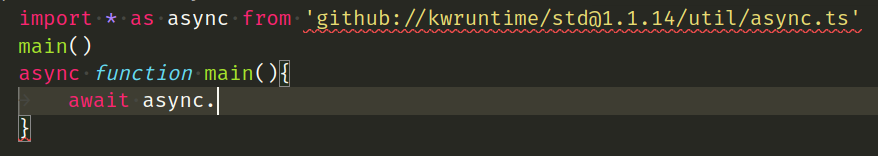
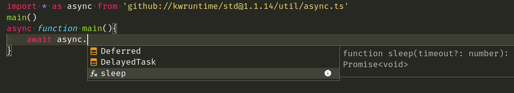
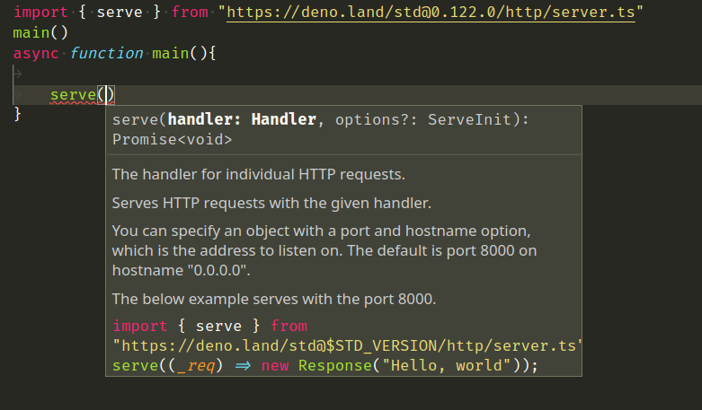
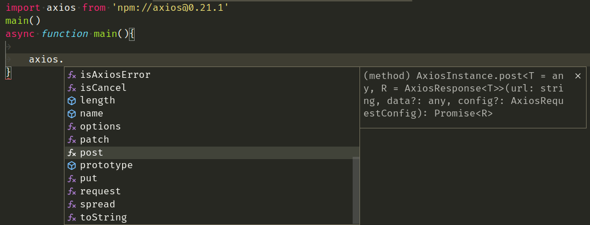
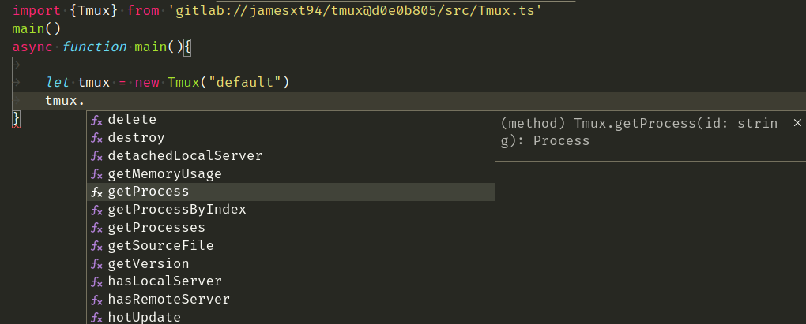

# kwruntime-plugin

Plugin for vscode, atom-ide, or any editor using typescript server, that allows ```Intellisense``` for importing from other protocols, no only from files. 
Made for usage with [kwruntime](https://github.com/kwruntime/core).

## Features

Visual Studio Code without plugin enabled:



Visual Studio Code with plugin enabled:




You can use intellisense for the same protocols supported by [kwruntime](https://github.com/kwruntime/core)

```typescript 
// Of course, kwruntime doesn't have support for `deno` modules
// but this shows how plugin can provide intellisense for http/https urls
import { serve } from "https://deno.land/std@0.122.0/http/server.ts"

// intelissense for npm:// imports
import axios from 'npm://axios@0.21.1'

// intelissense for github
import * as async from 'github://kwruntime/std@1.1.14/util/async.ts'
//same as: import * as async from 'gh+/kwruntime/std@1.1.14/util/async.ts'

// intelissense for gitlab
import {Tmux} from 'gitlab://jamesxt94/tmux@d0e0b805/src/Tmux.ts'
```

See in action: 






## How to use?

1. Install [kwruntime](https://github.com/kwruntime/core).
2. Create a tsconfig.json with this content (see the plugins section): 

```json 
{
	"compilerOptions": {
		"moduleResolution": "node",
		"module": "es2020",
		"target": "esnext",
		"outDir": "out",
		"lib": [
			"es6",
			"dom"
		],
		"esModuleInterop": true,
		"sourceMap": true,
		"paths": {
			"*.ts": "*"
		},
		"plugins": [{ "enableForWorkspaceTypeScriptVersions": true, "name": "kwruntime-plugin" }]
	},
	"exclude": [
		"node_modules",
		".vscode-test"
	]
}
``` 

3. Install this repo as the plugin. In your package.json add dev dependency

```json 
"devDepedencies": {
	"typescript": "^4.5.x",
	"kwruntime-plugin": "git://github.com/kwruntime/vscode-plugin"
}
```

4. Install the module
5. If you use ```vscode``` make CTRL+SHIFT+P and search "Select Typescript version", and please select the local node_modules installed typescript package.